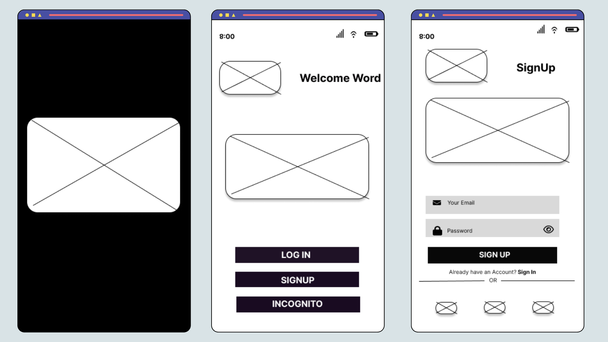
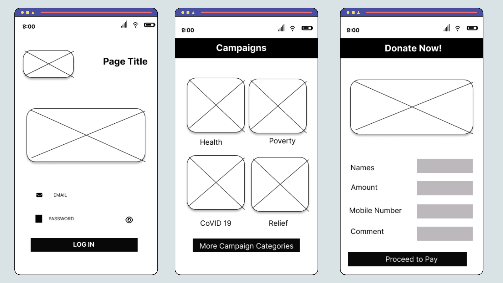
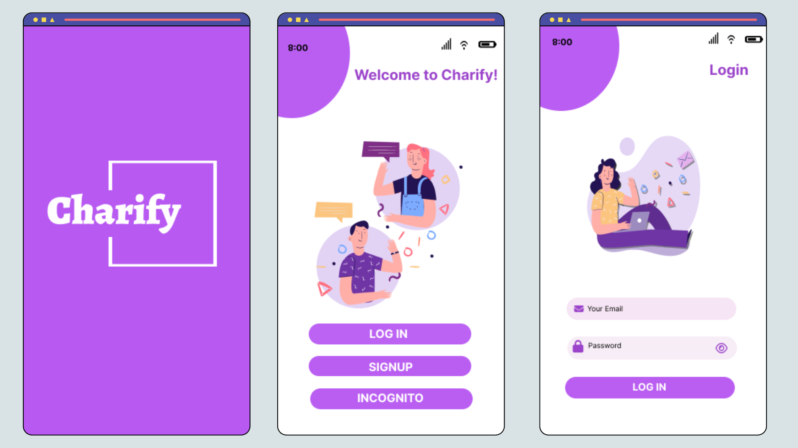
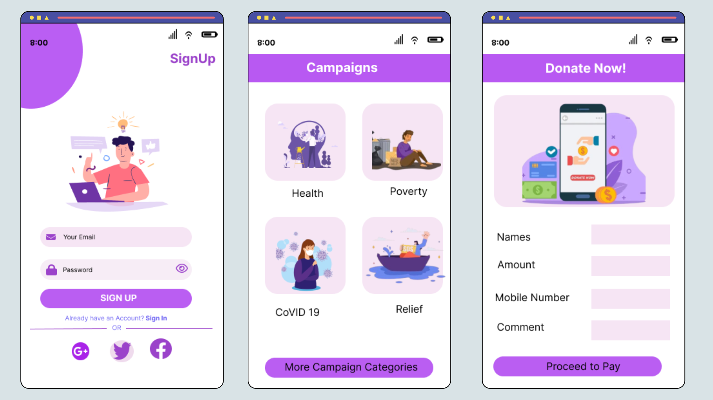

# Charify Crowdfunding Platform - Prototype Overview

## Project Overview
Charify is an innovative crowdfunding platform designed to empower communities and individuals to launch and support fundraising campaigns seamlessly. Our goal is to facilitate transparent and user-friendly experiences for campaign creators and donors alike. This repository includes both low-fidelity (Lo-Fi) and high-fidelity (Hi-Fi) prototypes created using Figma, showcasing the core user flow and interactions of the Charify platform.

## Prototype Details
We designed six primary screens to capture the essential user interactions on Charify:

1. **Splash Screen**: 
   - **Purpose**: The initial loading screen that introduces the platform’s branding and sets the tone for the app experience.
   - **Design Elements**: Display of the Charify logo and a brief animation to engage users.

2. **Welcome Screen**:
   - **Purpose**: Greets users with a brief introduction and provides options to proceed to login or sign up.
   - **Design Elements**: Minimalist design with clear call-to-action buttons ("Log In" and "Sign Up").

3. **Login Screen**:
   - **Purpose**: Allows returning users to log in to their accounts.
   - **Design Elements**: Form fields for email/username and password with a “Forgot Password?” link and a “Login” button.

4. **Signup Screen**:
   - **Purpose**: Enables new users to create an account.
   - **Design Elements**: Simple registration form with input fields for name, email, and password, along with a “Sign Up” button and terms of service acknowledgment.

5. **Campaigns Screen**:
   - **Purpose**: Displays an overview of ongoing campaigns that users can browse and select to learn more.
   - **Design Elements**: Campaign cards showcasing titles, images, and progress bars indicating the amount raised.

6. **Donations Screen**:
   - **Purpose**: Facilitates the process for users to contribute to a chosen campaign.
   - **Design Elements**: Details of the selected campaign, a donation input field, and a “Donate Now” button.

## Design Stages
### 1. Low-Fidelity (Lo-Fi) Prototypes
- **Objective**: Focus on basic layout, structure, and user flow without detailed design elements.
- **Tools Used**: Figma's basic shapes and text labels.
- **Outcome**: Quick visualization of how screens and interactions are organized, allowing for early-stage feedback and iterative changes.

    

    

### 2. High-Fidelity (Hi-Fi) Prototypes
- **Objective**: Refine the user experience by incorporating final design elements such as color schemes, typography, images, and interactive components.
- **Tools Used**: Figma with detailed design assets and components.
- **Outcome**: A realistic representation of the final product, showcasing the full user experience with visually appealing elements and micro-interactions.

    

---

    

## Key Features Demonstrated
- **User-Friendly Navigation**: Clear and intuitive navigation between screens to ensure a seamless user journey.
- **Visual Consistency**: Consistent color schemes and typography to establish brand identity.
- **Interactive Elements**: Responsive buttons and input fields to simulate real user interactions.

## How to Access the Prototypes
- **Lo-Fi Prototype**: [Link to Lo-Fi Prototype](#)
- **Hi-Fi Prototype**: [Link to Hi-Fi Prototype](#)

## Future Plans
- **User Testing**: Collect feedback from users to identify areas for improvement.
- **Enhanced Features**: Expand the platform to include user profiles, advanced search filters, and social sharing options.

## Conclusion
This Figma prototype demonstrates the initial design concept for Charify, laying the foundation for future development and user testing. We hope this project inspires further contributions and insights as we move towards building a robust and impactful crowdfunding platform.

